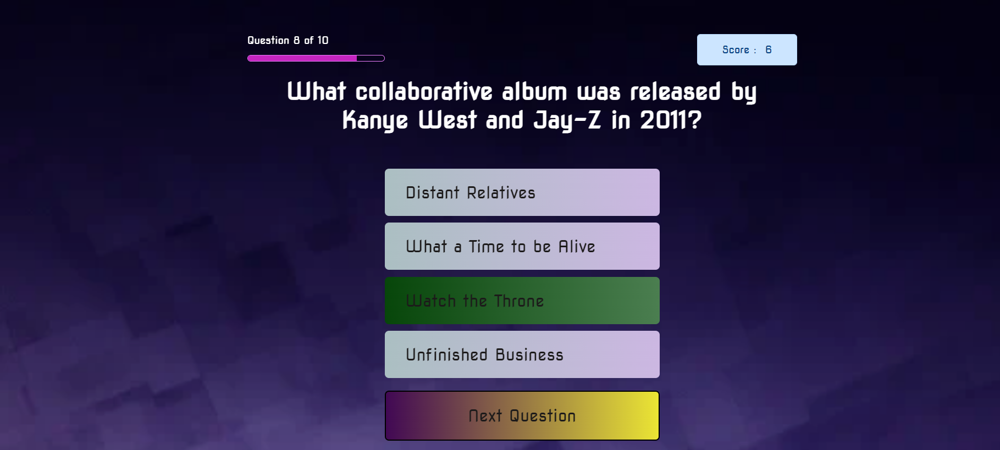

# Quiz App

---

## How does Quiz App be used?

Quiz App  is a kind of multiple-choice test.



---

- The user cannot go to the next question without answering the question. After answering, the button appears to go to the next question..

- If the user answers correctly, the selected answer becomes green; if incorrect, the selected answer becomes red.

- The score increases when the correct answer is given.

-The user can see which question s/he is in from the Progress bar.


---

- When the user refreshes the page, s/he continues with the score of the question she left.

- On the last page, s/he sees how many questions she answered correctly in total.


## Demo

Here is a working live demo :[Demo](https://asiyegokalp.github.io/Photon/)

---

## ES6 + Features

- Arrow Functions
- Modules export/import
- localStorage

---

## Structure

```
├── images
│   ├── ph1.png
│   └── ph2.png
│
├── public
│   └── style.css
├── src
│   ├── page
│   │     ├── finalSummaryPage.js
│   │     ├── questionPage.js
│   │     ├── README.md
│   │     └── welcomePage.js   
│   └── view
│         ├──answerView.js
│         ├──createQuestionNumberView.js
│         ├──finalSummaryView.js
│         ├──questionView.js
│         ├──README.md
│         ├──scoreView.js
│         └──welcomeView.js
├── app.js
├── constant.js
├── data.js
├── index.html
└── README.md

```

